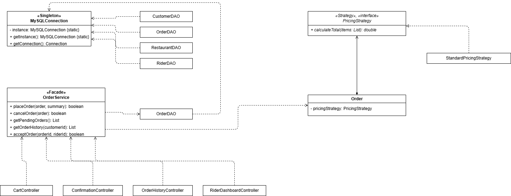
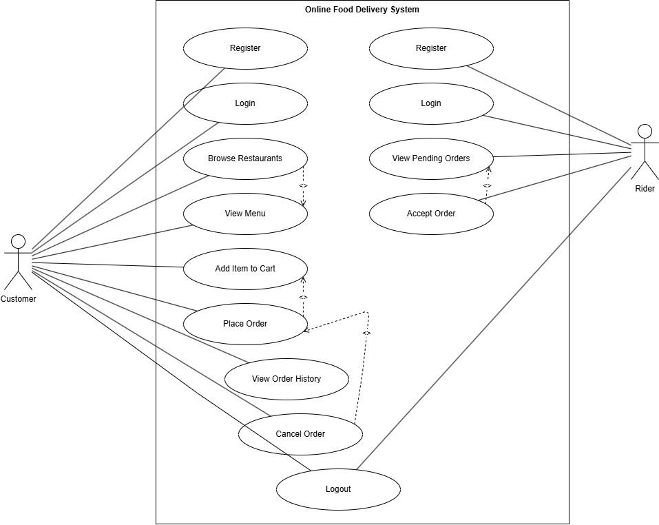
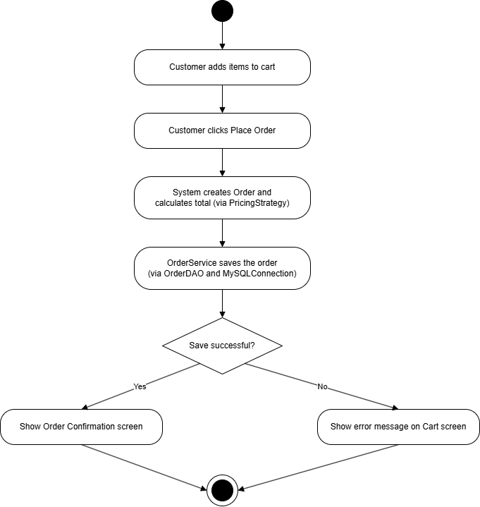
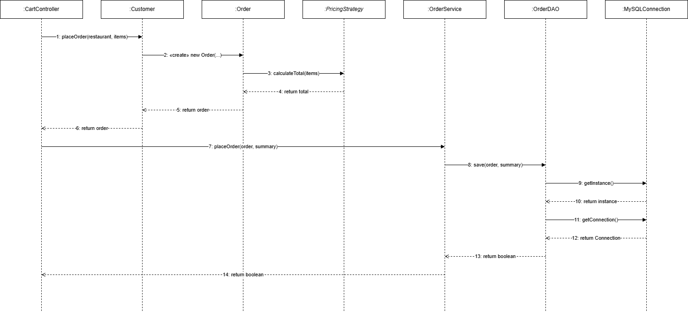

# Online Food Delivery System

A JavaFX desktop application that connects customers, restaurants, and delivery
riders. Customers can browse restaurants, view menus, add items to a cart,
place an order, and track its status. Riders can log in separately, view
pending orders, and accept deliveries. The system uses a MySQL database (via
XAMPP) for persistent storage of customers, riders, restaurants, menu items,
and orders.

## Major Features

- **Customer flow:** Register → Login → Choose a Restaurant → Browse Menu →
  Add to Cart → Checkout → Place Order → Confirmation (with option to cancel).
- **Restaurant selection:** Customers can browse multiple restaurants and
  view each one's own menu before ordering.
- **Order history:** Customers can view all their past orders, including
  cancelled ones.
- **Rider flow:** Register → Login → View Pending Orders → Accept Order
  (order is linked to the accepting rider in the database).
- **Session management:** Login state is preserved using Java Serialization
  (see below).
- **Database-backed persistence:** All customers, riders, restaurants, menu
  items, and orders are stored in and retrieved from a MySQL database.

## Project Structure

```
com.example.capstone
├── main        → Application entry point (HelloApplication, Launcher)
├── controller  → JavaFX FXML controllers (one per screen)
├── dao         → Data Access Objects for database operations
├── service     → Facade layer simplifying order operations for controllers
├── strategy    → Pluggable order-pricing algorithms
├── model       → Domain classes (User, Customer, Rider, Order, etc.)
└── util        → Shared utilities (MySQLConnection, SessionManager)
```

## Session Management via Java Serialization

When a customer or rider successfully logs in, the `SessionManager` class
serializes the logged-in `User` object (specifically a `Customer` or `Rider`,
both of which implement `Serializable`) to a local file named `session.dat`
using `ObjectOutputStream`.

- **Creation:** On successful login, `SessionManager.saveSession(user)` writes
  the user object to `session.dat`.
- **Usage:** On app startup, `HelloApplication` calls
  `SessionManager.loadSession()` to check for an existing session. If a valid
  session is found, the user is taken straight to their home screen (skipping
  Login), demonstrating that the file is used to validate and maintain the
  session as the user navigates the system.
- **Deletion:** When the user clicks **Logout**, `SessionManager.clearSession()`
  deletes `session.dat` from disk, and the user is redirected back to the
  Login screen.

## SOLID Principles Applied

### 1. Single Responsibility Principle (SRP)

The `SessionManager` class (in the `util` package) has exactly one
responsibility: managing the session file (saving, loading, and clearing it).
Each controller that needs to know who is logged in calls a single method
(`saveSession`, `clearSession`) rather than implementing file I/O itself.

**Benefit:** If the session storage mechanism ever changes, only
`SessionManager` needs to be modified — no controller code changes are
required.

### 2. Dependency Inversion Principle (DIP)

The `User` abstract class acts as a high-level abstraction that `Customer`
and `Rider` depend on, rather than duplicating login/session logic in each
subclass.

**Benefit:** The system can support new user types without rewriting the
controllers that rely on user authentication.

## Design Patterns Applied

### 1. Singleton (Creational)

`MySQLConnection` (in the `util` package) uses the Singleton pattern —
its constructor is private, and the only way to obtain the class is through
`MySQLConnection.getInstance()`, which guarantees only one instance of the
connection manager ever exists across the whole application. Every DAO class
(`CustomerDAO`, `OrderDAO`, `RestaurantDAO`, `RiderDAO`) now retrieves its
database connection through this single shared instance instead of calling a
scattered set of static methods.

**Benefit:** There is one clearly defined, centralized point of access for
database connectivity. If connection settings (URL, credentials, pooling
behavior) ever need to change, only `MySQLConnection` needs to be updated.

### 2. Facade (Structural)

`OrderService` (in the new `service` package) acts as a Facade over
`OrderDAO`. Instead of controllers (`CartController`, `ConfirmationController`,
`OrderHistoryController`, `RiderDashboardController`) calling `OrderDAO`
directly and managing multi-step logic themselves (e.g. updating an `Order`
object's status *and* persisting it to the database), they now call one
simple method on `OrderService` — `placeOrder()`, `cancelOrder()`,
`getPendingOrders()`, `getOrderHistory()`, or `acceptOrder()`.

**Benefit:** Controllers are simplified and decoupled from the details of how
order operations are implemented. Any future changes to how an order is
placed, cancelled, or fetched only need to happen inside `OrderService`,
without touching the four controllers that use it.

### 3. Strategy (Behavioral)

`PricingStrategy` (in the new `strategy` package) defines a common interface
for calculating an order's total, with `StandardPricingStrategy` as the
default implementation. The `Order` class holds a `PricingStrategy` reference
and delegates its `calculateTotal()` method to whichever strategy is currently
set, instead of hard-coding the calculation logic itself.

**Benefit:** New pricing behaviors (e.g. a future discount or promo pricing
strategy) can be introduced by creating a new class that implements
`PricingStrategy`, without modifying the `Order` class at all.

## UML Diagrams

### Class Diagram



### Use Case Diagram



### Activity Diagram (Place Order)



### Sequence Diagram (Place Order



## Requirements

- Java 17+
- Maven
- MySQL (via XAMPP), running on `localhost:3306`, database name `fooddelivery`