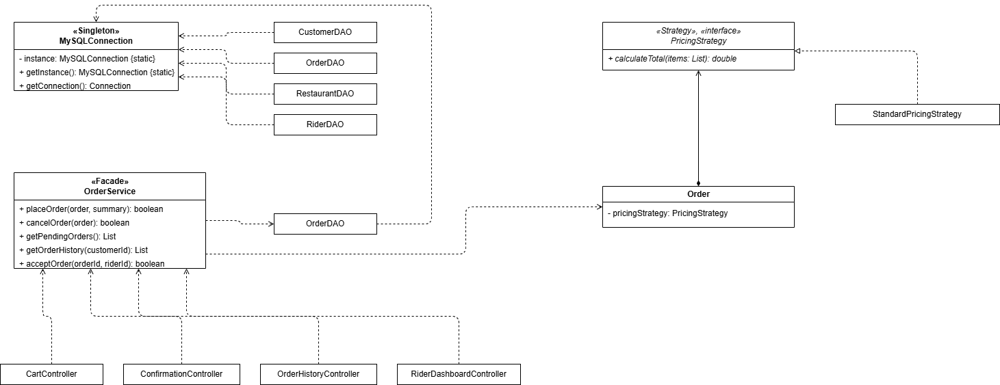
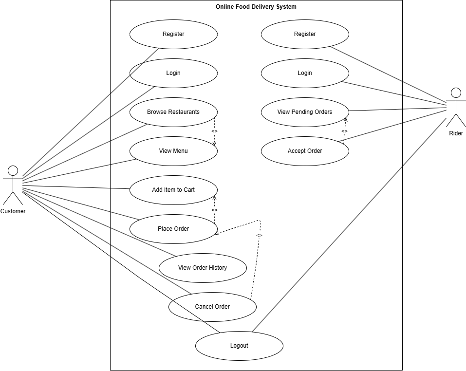
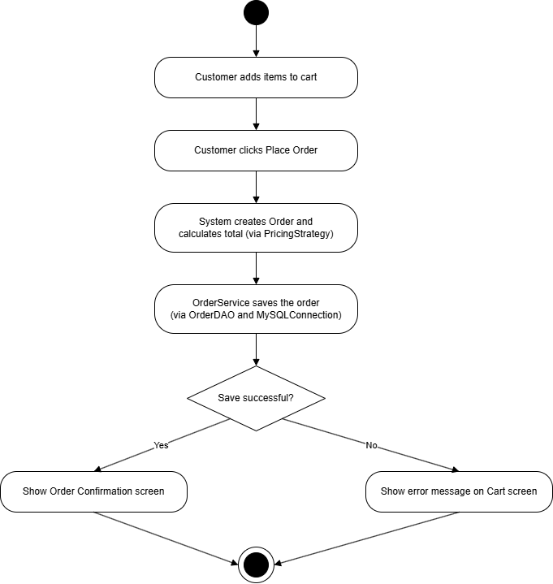
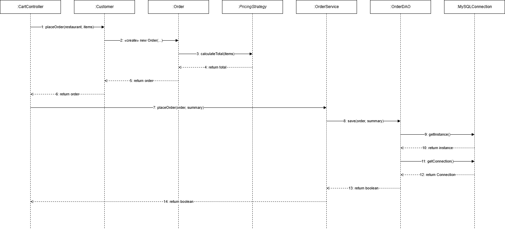

# Online Food Delivery System

A JavaFX desktop application that connects customers, restaurants, delivery
riders, and system administrators. Customers can browse multiple restaurants,
view menus with real food photos, add items to a cart, place an order, rate
the restaurant, and track their order history. Riders can log in separately,
view pending orders, and accept deliveries. Administrators can log in to view
system-wide user, restaurant, and revenue reports. The system uses a MySQL
database (via XAMPP) for persistent storage of customers, riders,
restaurants, menu items, orders, and admins.

## Major Features

- **Customer flow:** Register → Login → Choose a Restaurant → Browse Menu →
  Add to Cart → Checkout → Place Order → Confirmation (rate the restaurant or
  cancel the order) → Order History.
- **Restaurant selection:** Customers browse multiple restaurants, each shown
  with its real logo image, name, and address.
- **Order history:** Customers can view all past orders, including cancelled
  ones, with automatic text wrapping for long order summaries.
- **Rider flow:** Register → Login → View Pending Orders → Accept Order (the
  order is linked to the accepting rider in the database).
- **Admin flow:** Login (seeded account, no self-registration) → View Users,
  Restaurants, and Revenue Reports.
- **Session management:** Login state is preserved using Java Serialization
  for all three user types (Customer, Rider, Admin).
- **Input validation & password security:** Registration screens validate
  required fields, email format, duplicate emails, and minimum password
  length; passwords are hashed (SHA-256) before being stored.
- **Responsive UI via multithreading:** Login runs on a background thread so
  the interface never freezes while waiting on the database.
- **Payment tracking:** A `Payment` is created and processed when an order is
  placed, and automatically refunded if the order is cancelled.
- **Restaurant reviews:** Customers can rate a restaurant (1–5 stars, with an
  optional comment) after placing an order.
- **Fixed, phone-sized window:** The app opens at a consistent, non-resizable
  size across every screen.
- **Database-backed persistence:** All customers, riders, restaurants, menu
  items, orders, and admins are stored in and retrieved from a MySQL database.

## Project Structure

```
com.example.capstone
├── main        → Application entry point (HelloApplication, Launcher)
├── controller  → JavaFX FXML controllers (one per screen)
├── dao         → Data Access Objects for database operations
├── service     → Facade layer simplifying order operations for controllers
├── strategy    → Pluggable order-pricing algorithms
├── model       → Domain classes (User, Customer, Rider, Admin, Order, etc.)
└── util        → Shared utilities (MySQLConnection, SessionManager, PasswordUtil)
```

## Session Management via Java Serialization

When a customer, rider, or admin successfully logs in, the `SessionManager`
class serializes the logged-in `User` object (`Customer`, `Rider`, or
`Admin`, all of which implement `Serializable`) to a local file named
`session.dat` using `ObjectOutputStream`.

- **Creation:** On successful login, `SessionManager.saveSession(user)` writes
  the user object to `session.dat`.
- **Usage:** On app startup, `HelloApplication` calls
  `SessionManager.loadSession()` to check for an existing session. If a valid
  session is found, the user is taken straight to their appropriate home
  screen (Restaurant Selection, Rider Dashboard, or Admin Dashboard),
  skipping Login entirely — demonstrating that the file is used to validate
  and maintain the session as the user navigates the system.
- **Deletion:** When the user clicks **Logout**, `SessionManager.clearSession()`
  deletes `session.dat` from disk, and the user is redirected back to the
  Login screen.

## Multithreading

Login (for customers, riders, and admins) runs the database lookup on a
background thread instead of the JavaFX Application Thread, so the interface
stays responsive even if the database call is slow.

```java
Task<Customer> loginTask = new Task<>() {
    @Override
    protected Customer call() {
        return customerDAO.login(email, password);
    }
};
new Thread(loginTask).start();
```

`Task.setOnSucceeded()` automatically hands the result back to the JavaFX
Application Thread, so UI updates (like navigating to the next screen) happen
safely without directly touching UI components from a background thread.

To avoid a race condition where two threads could simultaneously try to
create the `MySQLConnection` singleton, `getInstance()` is declared
`synchronized`:

```java
public static synchronized MySQLConnection getInstance() {
    if (instance == null) {
        instance = new MySQLConnection();
    }
    return instance;
}
```

## Data Validation & Security

- Registration screens (`RegisterController`, `RiderRegisterController`)
  reject empty fields, invalid email formats, passwords shorter than 6
  characters, and emails that are already registered — before any insert is
  attempted.
- Passwords are never stored as plain text. `PasswordUtil` hashes passwords
  with SHA-256 before `CustomerDAO`/`RiderDAO` save them, and login compares
  the hash of the entered password against the stored hash.
- All SQL queries use `PreparedStatement` with parameterized placeholders
  (`?`), protecting against SQL injection.

## SOLID Principles Applied

### 1. Single Responsibility Principle (SRP)

The `SessionManager` class (in the `util` package) has exactly one
responsibility: managing the session file (saving, loading, and clearing it).
Each controller that needs to know who is logged in calls a single method
(`saveSession`, `clearSession`) rather than implementing file I/O itself.

**Benefit:** If the session storage mechanism ever changes, only
`SessionManager` needs to be modified — no controller code changes are
required.

### 2. Dependency Inversion Principle (DIP)

The `User` abstract class acts as a high-level abstraction that `Customer`,
`Rider`, and `Admin` all depend on, rather than duplicating login/session
logic in each subclass. Controllers work with this common `User` type rather
than depending on the concrete details of each subclass.

**Benefit:** The system supports multiple user types sharing the same
authentication and session logic, and adding a new user type (as was done
with `Admin`) required no changes to `SessionManager` or the shared
authentication flow.

## Design Patterns Applied

### 1. Singleton (Creational)

`MySQLConnection` (in the `util` package) uses the Singleton pattern — its
constructor is private, and the only way to obtain the class is through the
`synchronized` `MySQLConnection.getInstance()`, which guarantees only one
instance of the connection manager exists across the whole application, even
under concurrent access from multiple threads. Every DAO class (`CustomerDAO`,
`OrderDAO`, `RestaurantDAO`, `RiderDAO`, `AdminDAO`) retrieves its database
connection through this single shared instance.

**Benefit:** There is one clearly defined, centralized, thread-safe point of
access for database connectivity. If connection settings ever need to change,
only `MySQLConnection` needs to be updated.

### 2. Facade (Structural)

`OrderService` (in the `service` package) acts as a Facade over `OrderDAO`.
Instead of controllers (`CartController`, `ConfirmationController`,
`OrderHistoryController`, `RiderDashboardController`) calling `OrderDAO`
directly and managing multi-step logic themselves, they call one simple
method on `OrderService` — `placeOrder()`, `cancelOrder()`,
`getPendingOrders()`, `getOrderHistory()`, or `acceptOrder()`.

**Benefit:** Controllers are simplified and decoupled from the details of how
order operations are implemented. Future changes to order logic only need to
happen inside `OrderService`.

### 3. Strategy (Behavioral)

`PricingStrategy` (in the `strategy` package) defines a common interface for
calculating an order's total, with `StandardPricingStrategy` as the default
implementation. The `Order` class holds a `PricingStrategy` reference and
delegates its `calculateTotal()` method to whichever strategy is currently
set.

**Benefit:** New pricing behaviors (e.g. a future discount strategy) can be
introduced by creating a new class that implements `PricingStrategy`, without
modifying the `Order` class at all.

## Admin Functionality

An `Admin` user (seeded directly in the database, no self-registration) can
log in through a dedicated menu option and access a dashboard with three
real, working actions:

- **View Users** — lists every registered customer and rider.
- **View Restaurants** — lists every restaurant and its address.
- **View Reports** — shows total order count and total revenue across the
  system, excluding cancelled orders.

Each action calls a genuine method on the `Admin` model class
(`manageUsers()`, `manageRestaurants()`, `viewReports()`), which previously
existed only as empty method stubs.

## UML Diagrams

### Class Diagram



### Use Case Diagram



### Activity Diagram (Place Order)



### Sequence Diagram (Place Order)



## Requirements

- Java 17+
- Maven
- MySQL (via XAMPP), running on `localhost:3306`, database name `fooddelivery`